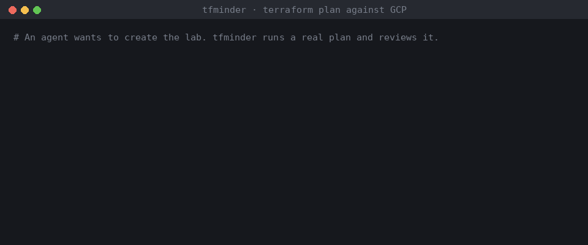

# tfminder

[](https://pypi.org/project/tfminder/)
[](https://github.com/MarckMorris/tfminder/actions/workflows/ci.yml)
[](https://www.python.org/downloads/)
[](LICENSE)

**Let AI agents run Terraform without handing them the keys.**

tfminder sits between an agent (Claude, Cursor, Copilot, anything that speaks
[MCP](https://modelcontextprotocol.io)) and your infrastructure. The agent can
plan. It can ask. It cannot approve itself, cannot apply a plan nobody
reviewed, and cannot quietly apply something different from what was reviewed.



<sub>Real output: `terraform plan` of [`examples/gcp-lab`](examples/gcp-lab) with Terraform 1.14 and the google
provider 6.50, reviewed by tfminder. Replayed by [`scripts/make_demo_gif.py`](scripts/make_demo_gif.py).</sub>

```
agent ──MCP──> review_plan(scope) ──> risk review + policy ──> allow / needs approval / deny
                                      (signed attestation)        │
                                                              │
human ── tfminder approve <id> (terminal, typed confirmation) ┘
                                                              │
agent ──MCP──> apply_approved ──> applies the exact reviewed plan file (sha256-pinned)
                                  └─> re-plans: did it converge? ─┤
everything ──> hash-chained audit log  ◄──────────────────────┘
```

Works with plain Terraform or OpenTofu, local or `gs://` state. No HCP account,
no SaaS, no agent-side credentials beyond what `terraform plan` already needs.

---

## Why

Terraform MCP servers make agents good at *writing* infrastructure code. The
hard part is the next step: letting the agent run it. The options today are
either read-only (safe, not very useful) or a flag that turns on writes with
nothing in between. Commercial platforms solve it inside their own control
plane. tfminder is that middle layer as a small open-source tool you run next
to your code.

## What an agent sees

A risky change, straight from the included example
([`examples/plans/gcp-risky.json`](examples/plans/gcp-risky.json)):

```
$ tfminder check examples/plans/gcp-risky.json
changes  create 2  update 2  delete 0  replace 0
  update                           google_compute_firewall.allow_ssh
  create                           google_storage_bucket_iam_member.reports_public
  update                           google_sql_database_instance.orders
  create                           google_pubsub_topic.events

CRITICAL GC001  Resource made public through IAM
         google_storage_bucket_iam_member.reports_public
         Grants roles/storage.objectViewer to allUsers: anyone on the internet.
CRITICAL GC006  Administrative or data port opened to the internet
         google_compute_firewall.allow_ssh
         Ingress from 0.0.0.0/0 now reaches 22/SSH
HIGH     RD004  Deletion protection removed
         google_sql_database_instance.orders
         deletion_protection goes from true to false. ...

decision DENY
```

Over MCP the agent gets the same data as JSON, plus a request id. A denied plan
cannot be submitted, approved or applied. The agent has to change the code.

A normal change, run for real against OpenTofu (`examples/local-lab`):

```
$ tfminder plan stack -j "ship api and worker"
request  20260925-163444-fbd46a   status: reviewed
changes  create 2  update 0  delete 0  replace 0
decision APPROVAL

$ tfminder approve 20260925-163444-fbd46a
Type fbd46a to approve applying this exact plan: fbd46a
approved 20260925-163444-fbd46a; valid until 2026-09-25T17:34:44+00:00

$ tfminder apply 20260925-163444-fbd46a
Apply complete! Resources: 2 added, 0 changed, 0 destroyed.

$ tfminder plan stack --destroy
decision DENY
  - plan destroys or replaces 2 resource(s); policy allows 1

$ tfminder audit verify
ok: 5 entries, chain intact, head a735bd68fe4c...
```

## How it decides

1. **Real plan.** `terraform plan -out` then `terraform show -json`. No parsing of HCL, no guessing.
2. **Risk review** with [pyrrho](https://github.com/MarckMorris/pyrrho)'s engine, which compares the
   planned state with the *prior* state, so a change is only blamed for what it changes. tfminder adds a
   `gcp-guard` analyzer for Google Cloud (below).
3. **Policy** from `.tfminder.yaml`, per environment and per workspace:

| Setting | Effect |
|---|---|
| `block_at` | Findings at or above this severity: **deny** |
| `approval_at` | Findings at or above this severity: a human must approve |
| `max_destroy` | More deletes + replacements than this: **deny** |
| `protected` | Address globs that may never be deleted or replaced |
| `deny_types` | Resource types an agent may never touch (e.g. `google_project_iam_policy`) |
| `approval_on_destroy` | Any delete/replace needs a human |
| `auto_apply` | Clean plans skip the human (off by default) |
| `approval_ttl_minutes` | Approvals expire |

| `require_scope` | The agent must declare which addresses it means to change |
| `deny_out_of_scope` | A plan touching anything outside the declared scope is denied (default on) |
| `verify_after_apply` | Re-plan after apply and record whether it converged (default on) |

Per workspace, `baseline:` points at a pyrrho baseline of accepted findings (`tfminder baseline <id> -o file`
writes one). Accepted findings stay visible; stale entries are reported so the file does not rot.

4. **Declared scope.** The agent says what it is changing (`scope=["google_compute_firewall.iap_ssh"]`).
   If the plan also touches anything else, pyrrho's RD007 flags it and tfminder denies it. A plan that does
   more than the agent said is exactly the failure mode to catch.
5. **Attested.** Every review writes a pyrrho attestation: plan SHA-256, analyzers, verdict, finding
   fingerprints. With `TFMINDER_ATTEST_KEY` set it is HMAC-signed. Approve and apply refuse if it changed.
6. **Apply** only if: a human approved it, the approval has not expired, the plan file's SHA-256 matches
   the one reviewed, the attestation checks out, and Terraform itself accepts the saved plan (it rejects
   stale plans if state moved).
7. **Verify.** After apply tfminder plans again. If anything is still left to change, the request is marked
   *not converged* and the audit log says so: a provider bug, a default the code does not pin, or someone
   changing things while the apply ran.

## Google Cloud rules (`gcp-guard`)

| Rule | Severity | Catches |
|---|---|---|
| GC001 | critical | `allUsers` / `allAuthenticatedUsers` added to any `google_*_iam_member/binding/policy` |
| GC002 | high | `roles/owner` or `roles/editor` granted |
| GC003 | high | Escalation roles granted (token creator, SA user, IAM admin...) |
| GC004 | high | Authoritative `*_iam_policy` written (can remove every other binding) |
| GC005 | medium | Firewall ranges/ports unknown until apply |
| GC006 | critical | SSH, RDP, databases, etcd, kubelet... opened to `0.0.0.0/0` |
| GC007 | medium | Any other non-web port opened to the internet |
| GC009 | medium | Long-lived service account key created |
| GC010 | critical | BigQuery, Spanner, Bigtable, disks, KMS keys, Redis, Filestore, AlloyDB... destroyed or replaced |
| GC011 | high | GKE cluster, secret, log sink, VPC, DNS zone destroyed |
| GC012 | high | `deletion_protection` turned off (GKE, BigQuery, Spanner, instances...) |
| GC013–16 | high/medium | Bucket public access prevention removed, `force_destroy`, versioning off, retention removed |
| GC017–18 | critical/high | Cloud SQL open to `0.0.0.0/0`, backups disabled |
| GC019–20 | high | GKE private endpoint turned off, master authorized networks removed |

Cloud SQL and bucket destruction and Cloud SQL deletion protection come from pyrrho (`RD001`, `RD002`,
`RD004`). They are not duplicated here. pyrrho's AWS rules run too.

## MCP tools, by tier

| Tier | Tools |
|---|---|
| `read` | `list_workspaces`, `list_requests`, `get_request`, `drift_scan` |
| `plan` | + `review_plan` (with declared `scope`), `submit_for_approval` |
| `apply` | + `apply_approved` |

There is no approve or reject tool at any tier.

`drift_scan` uses [strayform](https://github.com/MarckMorris/strayform) to compare live GCP (Cloud Asset
Inventory) with state: resources created by hand, resources in state that no longer exist, IaC coverage,
and ready-to-paste `import {}` blocks. That closes the loop: tfminder watches what goes in through
Terraform, strayform finds what went in around it.

## Keep cloud credentials out of the agent's process

By default the MCP server runs Terraform itself, so it needs cloud credentials. With

```yaml
executor: worker
```

it never runs Terraform. `review_plan`, `apply_approved` and `drift_scan` become jobs in `.tfminder/jobs/`,
and a worker that **you** start in your own terminal, with your own credentials, executes them:

```
agent ──MCP──> tfminder serve ──job file──> tfminder worker (your terminal, your credentials) ──> terraform
                   no credentials  <──result──        same policy, attestation and approval checks
```

The agent's host process holds no cloud credentials at all, and closing the worker window stops every
change. It also fixes MCP hosts that sandbox their servers: with the Microsoft Store build of Claude
Desktop on Windows, Terraform's provider plugins cannot start inside the MCP process (their loopback
mTLS handshake fails), but they run fine in the worker. This was verified live from Claude Desktop against
the Google provider.

## Quick start

```bash
pip install "tfminder[drift]"      # drop [drift] if you don't need GCP drift scans

cd your-infra-repo
tfminder init                 # writes .tfminder.yaml, one workspace per directory with .tf files
tfminder mcp-config           # prints the snippet for your MCP client
```

Claude Desktop / Claude Code (`claude mcp add` or the JSON config):

```json
{
  "mcpServers": {
    "tfminder": {
      "command": "tfminder",
      "args": ["serve"],
      "env": { "TFMINDER_CONFIG": "/path/to/repo/.tfminder.yaml", "TFMINDER_AGENT": "claude" }
    }
  }
}
```

Then ask the agent for a change. Review and approve in your terminal:

```bash
tfminder requests            # what is waiting
tfminder show <id>           # changes, findings, the agent's justification
tfminder approve <id>        # or: tfminder reject <id> -r "reason"
```

### In CI, without an agent: GitHub Action

```yaml
- run: terraform plan -out=tfplan && terraform show -json tfplan > plan.json
  working-directory: infra
- uses: MarckMorris/tfminder@v0
  with:
    plan: infra/plan.json
    config: .tfminder.yaml
    workspace: prod
    scope: "module.network.*"          # optional: what this PR claims to change
    sarif-location: infra/main.tf      # alerts land on the code in the Security tab
```

It comments the verdict on the pull request, writes it to the job summary, uploads SARIF to code scanning
and fails the check on deny (`strict: true` also fails when approval would be needed). The same thing from a
shell: `tfminder check plan.json --workspace prod --sarif out.sarif --format markdown`. A full workflow with
Workload Identity Federation is in [`examples/tfminder-pr-check.yml`](examples/tfminder-pr-check.yml).

### Try it

- `examples/local-lab`: no cloud account needed. Uses the built-in `terraform_data` resource.
- `examples/gcp-lab`: a VPC, a firewall rule, a bucket and a topic. Pennies to run. Destroy it through
  tfminder when you are done.

## Security model

Read [docs/threat-model.md](docs/threat-model.md) before exposing `tier: apply`. The short version:
tfminder is a boundary only if the agent's **only** way to reach Terraform is tfminder. An agent with a
shell and your cloud credentials can run `terraform apply` itself.

## What is verified, and what is not

- **Verified:** unit tests for every rule and policy path; end to end against a real OpenTofu 1.10 binary
  (plan → approve → apply, stale plan refused, tampered plan file refused, destroy limits); the MCP server
  tested over stdio with the official client on both `mcp` 1.x and 2.x. CI runs the same suite against
  Terraform and OpenTofu.
- **Verified against a real plan:** `tests/fixtures/gcp-lab-create.tf1.14.json` is a `terraform plan` of
  `examples/gcp-lab` captured with Terraform 1.14.4 and the google provider 6.50.0; the firewall rules run
  against it (clean, opened to the world, unknown ranges). It caught a real false positive in 0.1.0.
- **Not yet verified:** rules that need an existing resource (update-in-place cases) have only been tested
  against the documented plan format, not captured plans. The drift scan
  inherits strayform's status: it has not been run against a real project yet. Both are next.
- The audit log is tamper-evident, not tamper-proof. Ship it somewhere the agent cannot write.

## Development

```bash
pip install -e ".[dev,drift]"
ruff check . && pytest        # e2e tests run when terraform or tofu is on PATH
```

## License

Apache-2.0
